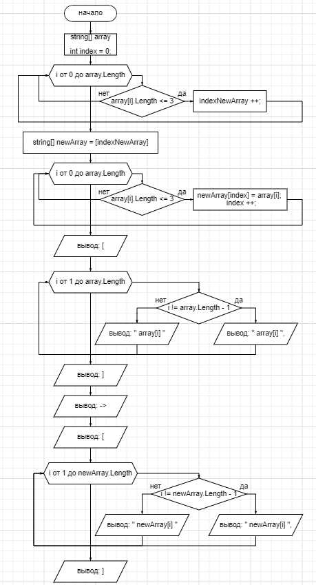

# Выполнение контрольной работы
### _**Задача**_: Написать программу, которая из имеющегося массива строк формирует новый массив из строк, длина которых меньше, либо равна 3 символам. Первоначальный массив можно ввести с клавиатуры, либо задать на старте выполнения алгоритма. При решении не рекомендуется пользоваться коллекциями, лучше обойтись исключительно массивами.

## __Блок схема алгоритма:__ 

## Этапы выполнения программы:
1. Объявление массива слов
2. Обьявление массива для слов, содержащих меньше или равное 3 количество символов. Размер массива определяется функцией *GetQuantity()*
3. Поиск и наполнения массива с <= 3 букв в словах выполняет функция *FindWords()*
4. Вывод массивов по аналогии с примером задании выполняет функция *PrintArray()*